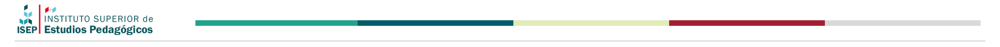

---
i
---

<div style="text-align: center;">
  
</div>

<div class="hero">
  <h1>Inscripciones: Períodos y Propuestas</h1>
  En esta sección, podrás consultar en qué períodos tuvimos prematriculaciones y para qué propuestas. Podés usar los filtros de año y mes -que corresponden a las fechas de inscripción (no de cursado)- o de tipo de inscripción. También tenés disponible el buscador por palabra clave para indagar los datos de prematriculación de una propuesta específica.
</div>

<!-- Load and transform the data -->

```js
//const data1 = FileAttachment("data/data.tsv").tsv({typed: true});

async function getTsv(url) {
  let names =[];
  const spreadsheet = await d3.tsv(url).then(data => data.forEach(d => names.push(d))); // d3.tsv returns a Promise
  return names;
}

const url = "https://docs.google.com/spreadsheets/d/e/2PACX-1vRyV5lbkXamFX_ORebRftxAEBQ0Hf2ugn9Em9i2YA4iirsUD006yQaAEdpJOC02haDAG0iNyD_U-Wkp/pub?gid=1045081279&single=true&output=tsv"

const data = await getTsv(url);

```

```js

const dataConAnios = data.filter(d => {

  const acred_unica = d["Criterio de carga"] === "Carrera - Acred. única";
  const acred_multi = d["Criterio de carga"] === "Carrera - Acred. múltiple estructurado";
  const acred_multi_flex = d["Criterio de carga"] === "Carrera - Acred. múltiple estructurado flexible";

  return acred_unica || acred_multi || acred_multi_flex;

}).filter(d => {
  return d["Inscripción: inicio"]
}).map(d => {
  // Convertir la fecha de "Inscripción: inicio" a un objeto Date
  const fecha = d["Inscripción: inicio"]
    ? new Date(d["Inscripción: inicio"].split("/").reverse().join("-"))
    : null;

    const fecha_f = d["Inscripción: fin"]
    ? new Date(d["Inscripción: fin"].split("/").reverse().join("-"))
    : null;

  //console.log(d);
  //console.log(fecha);
  

  const options = { month: "long" };
  
  // Retornar una nueva fila con una columna adicional "año"
  return {
    ...d, // Mantener las columnas existentes
    anio: fecha ? fecha.getFullYear() : null, // Agregar el año como una nueva clave
    mes: new Intl.DateTimeFormat("es-Es", options).format(fecha),
    mes_idx: fecha.getMonth(),
    inicio: fecha,
    fin: fecha_f
  };
});
```

<div class="grid grid-cols-2">

<div>

```js

const anios_a = Array.from(
  new Set(dataConAnios.map(d => {
    // Convertir "Inscripción: inicio" a tipo Date
    const fecha = d["Inscripción: inicio"]
      ? new Date(d["Inscripción: inicio"].split("/").reverse().join("-"))
      : null;
    // Extraer el año si la fecha es válida
    return fecha ? fecha.getFullYear() : null;
  }).filter(Boolean))).sort();


const anios = view(Inputs.select([null].concat(anios_a), {
    label: "Año",
    format: (t) => t ? String(t) : t,
  }));


```

```js
const meses = dataConAnios.filter(d => anios ? d["anio"] === anios : true)
      .map(d => ({mes: d["mes"], idx: d["mes_idx"]}))
      .sort((a, b) => a.idx - b.idx).map(d => d["mes"]);

const mes_a = Array.from(new Set(meses)).filter(Boolean) ;

const mes = view(Inputs.select([null].concat(mes_a), {label: "Mes"}));

const tipo_insc = view(Inputs.select([null, "Abierta","Cerrada"], {label: "Tipo de inscripción"}));

const search = view(Inputs.search(dataConAnios, {placeholder: "Buscar por palabra clave…", locale: "es"}));
```

</div>
<div class="grid grid-cols-3">
  <div class="card grid-colspan-3"><h2>Cantidad total de propuestas</h2><h1>${d3.count(dataFiltered, (d) => d["id"])}</h1></div>
  <div class="card"><h2>Acred. única</h2>
    <h1>${d3.count(dataFiltered.filter(d => d["Criterio de carga"] === "Carrera - Acred. única"), (d) => d["id"])}</h1>
  </div>
  <div class="card"><h2>Acred. múltiple estructurado</h2>
    <h1>${d3.count(dataFiltered.filter(d => d["Criterio de carga"] === "Carrera - Acred. múltiple estructurado"), (d) => d["id"])}</h1>
  </div>
  <div class="card"><h2>Carrera - Acred. múltiple estructurado flexible</h2>
    <h1>${d3.count(dataFiltered.filter(d => d["Criterio de carga"] === "Carrera - Acred. múltiple estructurado flexible"), (d) => d["id"])}</h1>
  </div>
</div>

</div>


```js
function wrapText(x, w) {
  return htl.html`<div style="
      text-align: center;
      color: black;
      word-wrap: break-word;
      overflow-wrap: break-word;
      white-space: normal;
      padding: 4px;
      width: ${w}px;">${x.toLocaleString("en-US")}</div>`
}

function wrapTextLink(x, w, href) {
  return htl.html`<a href=${href}
      target=_blank
      style=" display: block;
      text-align: center;
      word-wrap: break-word;
      overflow-wrap: break-word;
      white-space: normal;
      padding: 1px;
      width: ${w}px;">${x.toLocaleString("en-US")}</a>`
}
```

<div>
A continuación, podrás observar algunos datos de la prematriculación del período o propuesta/s seleccionada/s. Haciendo clic en cada propuesta, verás todos los datos de su prematriculación:
</div>

```js

const dataFiltered = search.filter(d => {
    // Filtrar dinámicamente según los valores de `anios` y `mes`
    const filtrarPorAnio = anios ? d["anio"] === anios : true;
    const filtrarPorMes = mes ? d["mes"] === mes : true;
    const filtrarPorTipo = tipo_insc ? d["propuesta: Tipo de inscripción"] === tipo_insc : true;

    // Retornar solo las filas que cumplen con los filtros activos
    return filtrarPorAnio && filtrarPorMes && filtrarPorTipo;
  
  })


  view(Inputs.table(dataFiltered, {
    columns: [
      "id",
      "Cohorte",
      //"Inscripción: inicio",
      //"Inscripción: fin",
      "inicio",
      "fin",
      "propuesta: Tipo de inscripción"
    ],
    header: {
      "id": "Propuesta",
      "propuesta: Tipo de inscripción": "Tipo de inscripción",
      "inicio": "Inscripción: inicio",
      "fin": "Inscripción: fin"
    },
    format: {
      id: id => {
        const propuesta = dataConAnios.filter(d => d.id===id)[0]["Propuesta"];
        //display(propuesta)
        //return htl.html`<a href=http://127.0.0.1:3000/propuesta-info?id=${id} target=_blank>${propuesta}</a>`
        //return htl.html`<a href=https://illak-zapata-ws.observablehq.cloud/fechas-clave/propuesta-info?id=${id} target=_blank>${propuesta}</a>`
        const link = "https://illak-zapata-ws.observablehq.cloud/fechas-clave/propuesta-info?id=" + id
        return wrapTextLink(propuesta, 250, link)

      },
      inicio: inicio => inicio.toLocaleDateString("es-AR"),
      fin: fin => fin.toLocaleDateString("es-AR")
    },
    layout: "auto",
    rows: 10,
    height: 500,
  
}))


```


<style>

  /* style.css */
  /* Aumentar tamaño de texto en todas las tablas */
  table {
    font-size: 1.1rem; /* Ajusta según necesites */
  }

  /* Específico para celdas de tabla */
  td, th {
    font-size: 1.3rem;
    line-height: 1.4; /* Mejora la legibilidad */
  }

  /* Solo para el contenido de las celdas */
  table td {
    font-size: 1rem;
  }

  /* Solo para los encabezados */
  table th {
    font-size: 1.1rem;
    font-weight: 600;
  }

  .hero {
    display: flex;
    flex-direction: column;
    align-items: left;
    font-family: var(--sans-serif);
    margin: 0rem 0 0rem;
    text-align: left;
  }

  .hero h1 {
    font-size: 2rem; /* Ajusta según sea necesario */
    line-height: 1.5;
    font-weight: bold;
    white-space: nowrap; /* Evita que el texto se divida en varias líneas */
    margin: 0;
  }
</style>